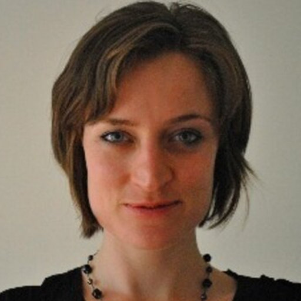

<head>
<meta name="viewport" content="width=device-width, initial-scale=1">

</head>
<body>

#  
#  
# Currently Supervised

 

### <i class="glyphicon glyphicon-user"></i> Arnaud Godin
Master Student in Epidemiology (McGill). Research Topic: *Modeling the potential impact of different prison-based prevention and treatment strategies for HCV transmission in Montréal*. Co-supervisor: [Joseph Cox](https://www.mcgill.ca/epi-biostat-occh/joseph-cox).  

 

### <i class="glyphicon glyphicon-user"></i> Carla Doyle
PhD Student in Epidemiology (McGill). Research Topic: *Modeling of HIV transmission among men who have sex with men in Montréal*. Co-supervisor: [Joseph Cox](https://www.mcgill.ca/epi-biostat-occh/joseph-cox).

 

### <i class="glyphicon glyphicon-user"></i> Charlotte Lanièce
PhD Student in Epidemiology (McGill). Research Topic: *HCV elimination among HIV co-infected populations in Canada*. Primary supervisor: [Marina Klein](http://rimuhc.ca/-/marina-klein-md-msc).  

 

### <i class="glyphicon glyphicon-user"></i> Branwen Owen
PhD Student in Epidemiology (Imperial College London). Research Topic: *Prevalence, determinants, and HIV risk of heterosexual anal intercourse*. Primary supervisor: [Marie Claude Boily](http://www.imperial.ac.uk/people/mc.boily).   

</body>

#
#  
# Past Supervision
#  
### <i class="glyphicon glyphicon-user"></i> Isabel Tavitian-Exley
PhD (Imperial College London). Thesis: *The relevance of polydrug use on HIV and associated injecting and sexual risk behaviours among people who inject drugs*. Primary supervisor: [Marie Claude Boily](http://www.imperial.ac.uk/people/mc.boily)