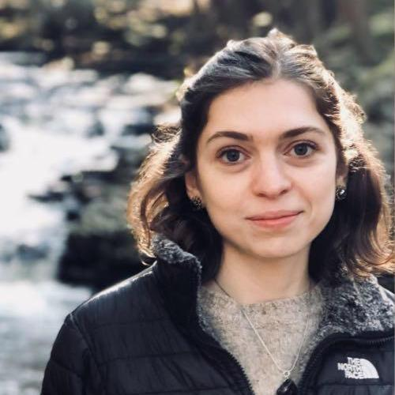
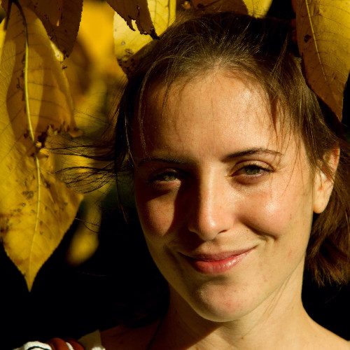

---
output:
  html_document: default
---

<head>
<meta name="viewport" content="width=device-width, initial-scale=1">

</head>
<body>
  
    
#  
#  
# Masters

  

 

### <i class = "glyphicon glyphicon-user"> </i> Ingrid Lu
MSc Student in Epidemiology (McGill). Research Topic: *Cost-effectiveness analysis of HIV self-testing in West Africa*.

### <i class = "glyphicon glyphicon-user"> </i> Vanessa (Fanyu) Xiu
MSc Student in Epidemiology (McGill). Research Topic: *Sexual networks of gay, bisexual, and other men who have sex with men in Canada: implications the transmission and control of monkeypox*.

#  
#  
# Doctoral 

### <i class = "glyphicon glyphicon-user"> </i> James Stannah
PhD Student in Epidemiology (McGill). Research Topic: *Structural determinants of HIV acquisition and transmission risks among key populations in sub-Saharan Africa*. Co-supervisor: [Marie-Claude Boily](https://www.imperial.ac.uk/people/mc.boily).

### <i class = "glyphicon glyphicon-user"> </i> Salome Kuchukhidze
PhD Student in Epidemiology (McGill). Research Topic: *HIV testing services and diagnosis coverage among key populations*. 

  

### <i class = "glyphicon glyphicon-user"> </i> Yiqing Xia
PhD Student in Epidemiology (McGill). Research Topic: *Surveillance and modeling for infectious diseases control*. 

#  
# Research Assistant
#  

### <i class = "glyphicon glyphicon-user"> </i> Jorge Luis Flores
Jorge holds a BSc in Microbiology and Immunology and recently graduated with a MSc in Epidemiology both from McGill University.

#  
# Research Associate
#  

### <i class = "glyphicon glyphicon-user"> </i> Carla Doyle
Dr. Carla Doyle holds a BSc in Mathematics & Statistics from Acadia University, and both MScPH and PhD in Epidemiology from McGill University.

#  
# Past Supervision
#  
 

### <i class = "glyphicon glyphicon-user"> </i> Adrien Allorant (Fellowship'23)
Postdoc (McGill). Research Topic: *Optimizing HIV testing services to end AIDS in sub-Saharan Africa*.

### <i class = "glyphicon glyphicon-user"> </i> Stephen Juwono (MSc'23)
MSc Epidemiology (McGill). Research Topic: *Intimate partner violence, substance use, and sexually transmitted infections among Canadian men who have sex with men: a cohort analysis (2017-2022)*.

### <i class = "glyphicon glyphicon-user"> </i> Lily (Peng) Yang (MSc'22)
MSc Epidemiology (McGill). Research Topic: *Trends and disparities in cervical cancer screening uptake in high HIV prevalence settings: a systematic analysis of population-based surveys in sub-Saharan Africa*.

  
  

### <i class = "glyphicon glyphicon-user"> </i> Caroline Hodgins (BSc'22)
Caroline was a *2020 Global Health Scholar* working on HIV diagnosis among clients of female sex workers.

 

### <i class = "glyphicon glyphicon-user"> </i> Paul Muset 
Paul was a *2021 Global Health Scholar* working on HIV testing modalities.

### <i class = "glyphicon glyphicon-user"> </i> Charlotte Lanièce (PhD'22)
PhD Epidemiology (McGill). Research Topic: *HCV elimination among HIV co-infected populations in Canada*. Primary supervisor: [Marina Klein](http://rimuhc.ca/-/marina-klein-md-msc).  

### <i class = "glyphicon glyphicon-user"> </i>  Jorge Luis Flores Anato (MSc'21)
MSc Epidemiology (McGill). Thesis: *Chemsex, sexually transmitted infections, and pre-exposure prophylaxis among men who have sex with men: longitudinal analyses of sexual health clinic attendees in Montréal*. 

 

### <i class = "glyphicon glyphicon-user"> </i>   Rachael Milwid (Fellowship'21)
Postdoctoral fellowship (McGill). Research Topic: *Modeling the impacts and optimization of HIV prevention packages among Montréal men who have sex with men*. Personal webpage: [here](https://rmilwid.wordpress.com/).

  
    

### <i class = "glyphicon glyphicon-user"> </i>   Katia Giguère (Fellowship'20)
Postdoctoral fellowship (McGill). Research Topic: *Estimating gaps in HIV knowledge status to reach the first UNAIDS 90-90-90 target in sub-Saharan Africa*.

  
   

### <i class = "glyphicon glyphicon-user"> </i>   Arnaud Godin (MSc'19)
MSc Epidemiology (McGill). Thesis: *Modeling the potential impact of different prison-based prevention and treatment strategies on HCV transmission in Montréal*. Co-supervisor: [Joseph Cox](https://www.mcgill.ca/epi-biostat-occh/joseph-cox).  

### Branwen Nia Owen (PhD'18)
PhD (Imperial College London). Thesis: *Neglected risk factors in HIV transmission and implications for prevention*. Primary supervisor: [Marie Claude Boily](http://www.imperial.ac.uk/people/mc.boily).   
  
### Isabel Tavitian-Exley (PhD'16)
PhD (Imperial College London). Thesis: *The relevance of polydrug use on HIV and associated injecting and sexual risk behaviours among people who inject drugs*. Primary supervisor: [Marie Claude Boily](http://www.imperial.ac.uk/people/mc.boily)

</body>
