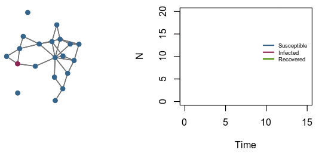

#

#
#
#
# <i class="fa fa-gear fa-spin fa-2x" style="color: chartreuse4"></i> Disease transmission dynamics
Mathematical models of infectious diseases - computer simulation of epidemics - enable researchers to study their transmission dynamics, to predict the potential population-level impact of interventions, and to optimize prevention/control programs. So far, my work as mainly focused on HIV and other STBBIs.

* Dynamics of HIV transmission among MSM in Québec
* Elimination of HCV among HIV coinfected populations in Canada
* Impact of targetted HIV treatment-as-prevention scenarions in Côte d'Ivoire.

  

#  
#  

# <i class="fa fa-calculator"></i> Epidemiology and measurements
Measurements of population health and its determinants is a key step to benchmark, monitor progress, and devise appropriate health policies. I use models to analyze and pool complex surveys for diverse health outcomes/indicators.

* Integrative Systems Modeling to estimate UNAIDS' first 90 (proportion of people living with HIV aware of their status) in sub-Saharan Africa. 
* Bayesian latent class model to ascertain the impact of imperfect immunoassays on HIV prevalence estimates.
* Global, regional, and national estimates of violence against women statistics.

#  
#  
# <i class="fa fa-globe"></i> Impact and economic evaluations
By comprehensively assessing the effects - intendend and unintended - of a health program, impact evaluations can generate new evidence, promote accountability, and prioritize public health actions. Combinined with complimentary cost-effectivness analyses, impact evaluation can help policy-makers chose those interventions that provides the biggest *bang for the buck*.

* Cost-effectiveness of accelerated HIV response scenarios in Côte d'Ivoire.
* Model-based impact evaluation of pre-exposure prophylaxis to reduce HIV transmission amogn men who have sex with men in Montréal.
* Potential impact and cost-effectiveness of prison-based interventions on HCV transmission among people who inject drugs.

